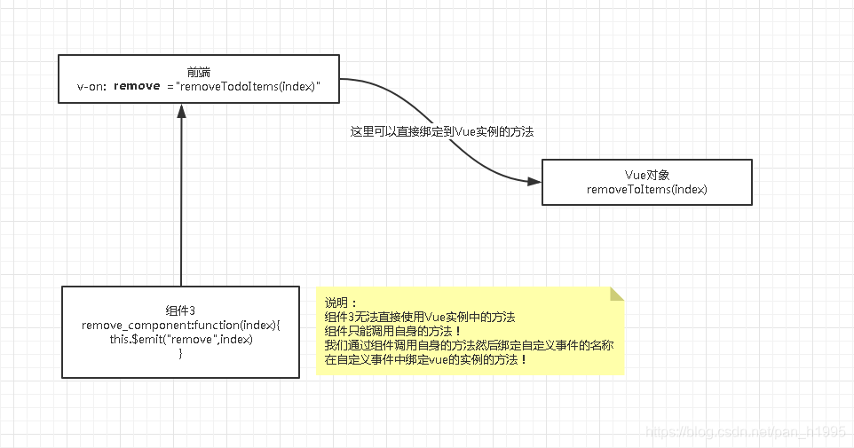

# 【狂神说Java】Vue学习笔记06----计算属性、内容分发、自定义事件

[参考原文链接](https://blog.csdn.net/pan_h1995/category_10128182.html)：https://blog.csdn.net/pan_h1995/category_10128182.html

> 本文根据B站【狂神说Java】vue系列视频整理，如需观看视频，请点击链接跳转
> [【狂神说Java】Vue视频](https://www.bilibili.com/video/BV18E411a7mC)

# 1、什么是计算属性

  计算属性的重点突出在`属性`两个字上(属性是名词)，首先它是个`属性`其次这个属性有`计算`的能力(计算是动词)，这里的`计算`就是个函数：简单点说，它就是一个能够将计算结果缓存起来的属性(将行为转化成了静态的属性)，仅此而已；可以想象为缓存!
  **上代码**

```html
<!DOCTYPE html>
<html lang="en">
<head>
    <meta charset="UTF-8">
    <title>Title</title>
</head>
<body>
<!--view层，模板-->
<div id="app">
    <p>currentTime1:{{currentTime1()}}</p>
    <p>currentTime2:{{currentTime2}}</p>
</div>

<!--1.导入Vue.js-->
<script src="https://cdn.jsdelivr.net/npm/vue@2.5.21/dist/vue.min.js"></script>
<script type="text/javascript">
    var vm = new Vue({
        el:"#app",
        data:{
          message:"pan"
        },
        methods:{
            currentTime1:function(){
                return Date.now();//返回一个时间戳
            }
        },
        computed:{
            currentTime2:function(){//计算属性：methods，computed方法名不能重名，重名之后，只会调用methods的方法
                this.message;
                return Date.now();//返回一个时间戳
            }
        }
    });
</script>
</body>
</html>
```

  注意：methods和computed里的东西不能重名
说明：

- **methods**：定义方法， 调用方法使用currentTime1()， 需要带括号
- **computed**：定义计算属性， 调用属性使用currentTime2， 不需要带括号：this.message是为了能够让currentTime2观察到数据变化而变化
- 如何在方法中的值发生了变化，则缓存就会刷新!可以在控制台使用`vm.message=”q in jiang"`， 改变下数据的值，再次测试观察效果!
    **结论：**
    ~~调用方法时，每次都需要讲行计算，既然有计算过程则必定产生系统开销，那如果这个结果是不经常变化的呢?此时就可以考虑将这个结果缓存起来，采用计算属性可以很方便的做到这点，**计算属性的主要特性就是为了将不经常变化的计算结果进行缓存，以节约我们的系统开销；**~~


# 2、内容分发

  在`Vue.js`中我们使用**slot**元素作为承载分发内容的出口，作者称其为插槽，可以应用在组合组件的场景中；

## 测试

  比如准备制作一个待办事项组件(todo) ， 该组件由待办标题(todo-title) 和待办内容(todo-items)组成，但这三个组件又是相互独立的，该如何操作呢?
  **第一步定义一个待办事项的组件**

```html
<div id="app">
    <todo></todo>
</div>
<!--1.导入Vue.js-->
<script src="https://cdn.jsdelivr.net/npm/vue@2.5.21/dist/vue.min.js"></script>
<script type="text/javascript">
    Vue.component('todo',{
        template:'<div>\
                <div>代办事项</div>\
                <ul>\
                    <li>学习狂神说Java</li>\
                </ul>\
            </div>'
    })
</script>
123456789101112131415
```

  **第二步 我们需要让，代办事项的标题和值实现动态绑定，怎么做呢？我们可以留一个插槽！**
  1-将上面的代码留出一个插槽，即slot

```html
 Vue.component('todo',{
        template:'<div>\
                <slot name="todo-title"></slot>\
                <ul>\
                    <slot name="todo-items"></slot>\
                </ul>\
            </div>'
    });
12345678
```

  2-定义一个名为todo-title的待办标题组件 和 todo-items的待办内容组件

```javascript
Vue.component('todo-title',{
        props:['title'],
        template:'<div>{{title}}</div>'
    });
   
12345
//这里的index，就是数组的下标，使用for循环遍历的时候，可以循环出来！
    Vue.component("todo-items",{
        props:["item","index"],
        template:"<li>{{index+1}},{{item}}</li>"
    });
12345
```

  3-实例化Vue并初始化数据

```javascript
 var vm = new Vue({
        el:"#vue",
        data:{
            todoItems:['test1','test2','test3']
        }
    });
123456
```

  4-将这些值，通过插槽插入

```html
<div id="vue">
    <todo>
        <todo-title slot="todo-title" title="秦老师系列课程"></todo-title>
        <!--<todo-items slot="todo-items" v-for="{item,index} in todoItems" v-bind:item="item"></todo-items>-->
        <!--如下为简写-->
        <todo-items slot="todo-items" v-for="item in todoItems" :item="item"></todo-items
    </todo>
</div>
12345678
```

  说明：我们的todo-title和todo-items组件分别被分发到了todo组件的todo-title和todo-items插槽中
  完整代码如下：

```html
<!DOCTYPE html>
<html lang="en">
<head>
    <meta charset="UTF-8">
    <title>Title</title>
</head>
<body>
<!--view层，模板-->
<div id="vue">
    <todo>
        <todo-title slot="todo-title" title="title"></todo-title>
        <!--<todo-items slot="todo-items" v-for="{item,index} in todoItems" v-bind:item="item"></todo-items>-->
        <!--如下为简写-->
        <todo-items slot="todo-items" v-for="item in todoItems" :item="item"></todo-items
    </todo>
</div>
<!--1.导入Vue.js-->
<script src="https://cdn.jsdelivr.net/npm/vue@2.5.21/dist/vue.min.js"></script>
<script type="text/javascript">
    Vue.component('todo',{
        template:'<div>\
                <slot name="todo-title"></slot>\
                <ul>\
                    <slot name="todo-items"></slot>\
                </ul>\
            </div>'
    });
    Vue.component('todo-title',{
        props:['title'],
        template:'<div>{{title}}</div>'
    });
    //这里的index，就是数组的下标，使用for循环遍历的时候，可以循环出来！
    Vue.component("todo-items",{
        props:["item","index"],
        template:"<li>{{index+1}},{{item}}</li>"
    });

    var vm = new Vue({
        el:"#vue",
        data:{
            title:"秦老师系列课程",
            todoItems:['test1','test2','test3']
        }
    });
</script>
</body>
</html>
1234567891011121314151617181920212223242526272829303132333435363738394041424344454647
```

# 3、自定义事件

  通以上代码不难发现，数据项在Vue的实例中， 但删除操作要在组件中完成， 那么组件如何才能删除Vue实例中的数据呢?此时就涉及到参数传递与事件分发了， Vue为我们提供了自定义事件的功能很好的帮助我们解决了这个问题； 使用this.$emit(‘自定义事件名’， 参数) ， 操作过程如下：
  1-在vue的实例中增加了methods对象并定义了一个名为removeTodoltems的方法

```html
var vm = new Vue({
        el:"#vue",
        data:{
            title_text:"秦老师系列课程",
            todoItems:['test1','test2','test3']
        },
        methods:{
            removeItems:function(index){
                console.log("删除了"+this.todoItems[index]+"OK");
                //splice（） 方法向/从数组中添加/删除项目，然后返回被删除的项目，其中index
                this.todoItems.splice(index,1);
            }
        }
    });
1234567891011121314
```

  2-修改todo-items待办内容组件的代码，增加一个删除按钮，并且绑定事件！

```html
 Vue.component("todo-items",{
        props:["item_p","index_p"],
        template:"<li>{{index_p+1}},{{item_p}} <button @click='remove'>删除</button></li>",
        methods:{
            remove:function (index) {
            //这里的remove是自定义事件名称，需要在HTML中使用v-on:remove的方式
                //this.$emit 自定义事件分发
                this.$emit('remove',index);
            }
        }
    });
1234567891011
```

  3-修改todo-items待办内容组件的HTML代码，增加一个自定义事件，比如叫remove，可以和组件的方法绑定，然后绑定到vue的方法！

```html
<!--增加了v-on:remove="removeTodoItems(index)"自定义事件，该组件会调用Vue实例中定义的-->
<todo-items slot="todo-items" v-for="(item,index) in todoItems"
                    :item_p="item" :index_p="index" v-on:remove="removeItems(index)" :key="index"></todo-items>
123
```

  **对上一个代码进行修改，实现删除功能**

```html
<!DOCTYPE html>
<html lang="en">
<head>
    <meta charset="UTF-8">
    <title>Title</title>
</head>
<body>
<!--view层，模板-->
<div id="vue">
    <todo>
        <todo-title slot="todo-title" :title="title_text"></todo-title>
        <!--<todo-items slot="todo-items" v-for="(item,index) in todoItems" v-bind:item="item"></todo-items>-->
        <!--如下为简写-->
        <todo-items slot="todo-items" v-for="(item,index) in todoItems"
                    :item_p="item" :index_p="index" v-on:remove="removeItems(index)" :key="index"></todo-items>
    </todo>
</div>
<!--1.导入Vue.js-->
<script src="../js/vue.js"></script>
<script type="text/javascript">
    Vue.component('todo',{
        template:'<div>\
                <slot name="todo-title"></slot>\
                <ul>\
                    <slot name="todo-items"></slot>\
                </ul>\
            </div>'
    });
    Vue.component('todo-title',{
        props:['title'],
        template:'<div>{{title}}</div>'
    });
    //这里的index，就是数组的下标，使用for循环遍历的时候，可以循环出来！
    Vue.component("todo-items",{
        props:["item_p","index_p"],
        template:"<li>{{index_p+1}},{{item_p}} <button @click='remove_methods'>删除</button></li>",
        methods:{
            remove_methods:function (index) {
                //this.$emit 自定义事件分发
                this.$emit('remove',index);
            }
        }
    });

    var vm = new Vue({
        el:"#vue",
        data:{
            title_text:"秦老师系列课程",
            todoItems:['test1','test2','test3']
        },
        methods:{
            removeItems:function(index){
                console.log("删除了"+this.todoItems[index]+"OK");
                this.todoItems.splice(index,1);
            }
        }
    });
</script>
</body>
</html>
123456789101112131415161718192021222324252627282930313233343536373839404142434445464748495051525354555657585960
```

## 逻辑理解



# 4、Vue入门小结

  核心：数据驱动，组件化

  优点：借鉴了AngularJS的模块化开发和React的虚拟Dom，虚拟Dom就是把Demo操作放到内存中执行；

  常用的属性：

- v-if
- v-else-if
- v-else
- v-for
- v-on绑定事件，简写@
- v-model数据双向绑定
- v-bind给巨剑绑定参数，简写：

  组件化：

- 组合组件slot插槽
- 组件内部绑定事件需要使用到`this.$emit("事件名",参数);`
- 计算属性的特色，缓存计算数据

  遵循SoC关注度分离原则，Vue是纯粹的视图框架，并不包含，比如Ajax之类的通信功能，为了解决通信问题，我们需要使用Axios框架做异步通信；

## 说明

  Vue的开发都是要基于NodeJS，实际开发采用Vue-cli脚手架开发，vue-router路由，vuex做状态管理；Vue UI，界面我们一般使用ElementUI（饿了么出品），或者ICE（阿里巴巴出品）来快速搭建前端项目~~

  官网：

- https://element.eleme.cn/#/zh-CN
- https://ice.work/