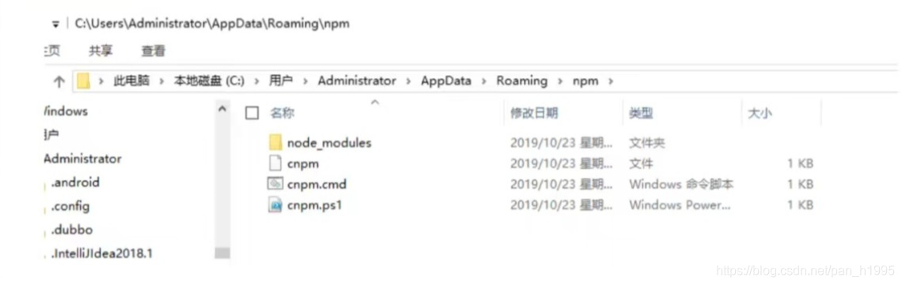
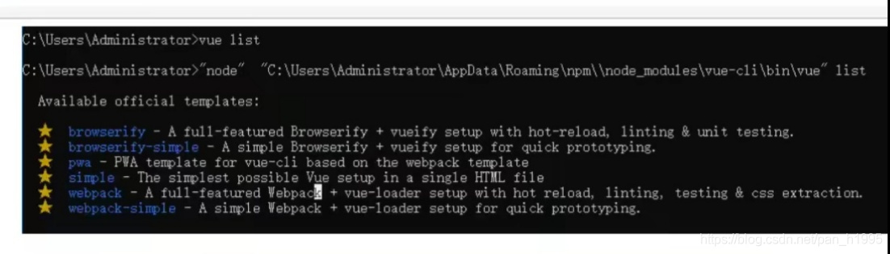
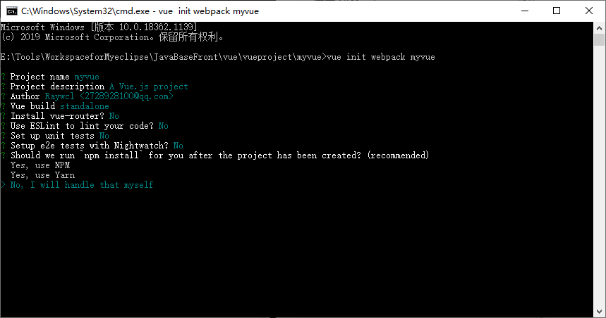
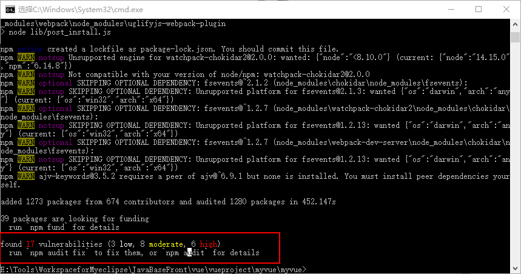

# 【狂神说Java】Vue学习笔记07-----第一个vue-cli项目

[参考链接](https://blog.csdn.net/pan_h1995/article/details/106840497)

https://blog.csdn.net/pan_h1995/category_10128182.html)

版权

> 本文根据B站【狂神说Java】vue系列视频整理，如需观看视频，请点击链接跳转
> [【狂神说Java】Vue视频](https://www.bilibili.com/video/BV18E411a7mC)

# 1、什么是vue-cli

  vue-cli官方提供的一个脚手架，用于快速生成一个vue的项目模板；
  预先定义好的目录结构及基础代码，就好比咱们在创建Maven项目时可以选择创建一个骨架项目，这个估计项目就是脚手架，我们的开发更加的快速；

  **项目的功能**

- 统一的目录结构
- 本地调试
- 热部署
- 单元测试
- 集成打包上线

# 2、需要的环境

## 2.1 Node.js：http://nodejs.cn/download/

  安装就是无脑的下一步就好，安装在自己的环境目录下

## 2.2 Git：https://git-scm.com/doenloads

  镜像：https://npm.taobao.org/mirrors/git-for-windows/

## 2.3 **确认nodejs安装成功：**

- cmd下输入`node -v`，查看是否能够正确打印出版本号即可！

- cmd下输入`npm -v`，查看是否能够正确打印出版本号即可！

```cmd
C:\Users\Administrator>node -v
v14.15.0

C:\Users\Administrator>npm -v
6.14.8
```


这个npm，就是一个软件包管理工具，就和linux下的apt软件安装差不多！

## 2.4 **安装Node.js淘宝镜像加速器（cnpm）**

这样的话，下载会快很多~

```sh
方法1
# -g 就是全局安装
npm install cnpm -g

方法2
# 或使用如下语句解决npm速度慢的问题
npm install --registry=https://registry.npm.taobao.org
```

  安装的过程可能有点慢~，耐心等待！虽然安装了cnpm，但是尽量少用！
  安装的位置：`C:\Users\administrator\AppData\Roaming\npm`



## 2.5 **安装vue-cli**

```sql
C:\Users\Administrator>cnpm install vue-cli -g
```

然后检测结果

```cmd
#测试是否安装成功#查看可以基于哪些模板创建vue应用程序，通常我们选择webpack
C:\Users\Administrator>vue list

  Available official templates:

  ★  browserify - A full-featured Browserify + vueify setup with hot-reload, linting & unit testing.
  ★  browserify-simple - A simple Browserify + vueify setup for quick prototyping.
  ★  pwa - PWA template for vue-cli based on the webpack template
  ★  simple - The simplest possible Vue setup in a single HTML file
  ★  webpack - A full-featured Webpack + vue-loader setup with hot reload, linting, testing & css extraction.
  ★  webpack-simple - A simple Webpack + vue-loader setup for quick prototyping.

```





# 3、第一个vue-cli应用程序

## 3.1.创建一个Vue项目，我们随便建立一个空的文件夹在电脑上，我这里在D盘下新建一个目录

```
D:\Project\vue-study;
```

## 3.2.创建一个基于webpack模板的vue应用程序

```sql
#1、首先需要进入到对应的目录 cd D:\Project\vue-study
#2、这里的myvue是顶日名称，可以根据自己的需求起名
vue init webpack myvue
```

  一路都选择no即可；
  **说明：**

- Project name：项目名称，默认回车即可
- Project description：项目描述，默认回车即可
- Author：项目作者，默认回车即可
- Vue build (Use arrow keys)：选择第一个即可
- Install vue-router：是否安装vue-router，选择n不安装（后期需要再手动添加）
- Use ESLint to lint your code:是否使用ESLint做代码检查，选择n不安装（后期需要再手动添加)
- Set up unit tests:单元测试相关，选择n不安装（后期需要再手动添加）
- Setupe2etests with Nightwatch：单元测试相关，选择n不安装（后期需要再手动添加）
- Should we run npm install for you after the,project has been created:创建完成后直接初始化，选择n，我们手动执行；运行结果！

```cmd
E:\Tools\WorkspaceforMyeclipse\JavaBaseFront\vue\vueproject\myvue>vue init webpack myvue

? Project name myvue
? Project description A Vue.js project
? Author Raywcl <2728928100@qq.com>
? Vue build standalone
? Install vue-router? No
? Use ESLint to lint your code? No
? Set up unit tests No
? Setup e2e tests with Nightwatch? No
? Should we run `npm install` for you after the project has been created? (recommended)
  Yes, use NPM
  Yes, use Yarn
> No, I will handle that myself 
```




## 3.3 初始化并运行

```
cd myvue
npm install  #安装依赖弧环境
npm run dev  #开启运行项目
```

  执行完成后，目录多了很多依赖

当出现问题时，可以查看提示进行处理如下



