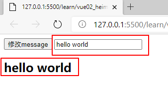
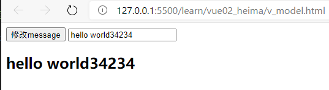

# HTML-b站-前端基础必会教程-4个小时带你快速入门vue

**[参考文章](https://blog.csdn.net/yt_xy/article/details/108994444)**

版权

> 官方文档：https://cn.vuejs.org/
> 视频链接：https://www.bilibili.com/video/BV12J411m7MG?from=search&seid=9046104301356848742

### 导入Vue

```html
<!-- 开发环境版本，包含了有帮助的命令行警告 -->
<script src="https://cdn.jsdelivr.net/npm/vue/dist/vue.js"></script>
```

### el-挂载点

用来设置Vue实例挂载（管理）的元素

```html
<div id="app">
    {{ message }}
</div>
<script>
    var app = new Vue({
        el:"#app",
        data:{
            message:"hello world"
        }
    })
</script>
```

> Vue实例的作用范围是什么呢?
> -Vue会管理el选项命中的元素及其内部的后代元素
> 是否可以使用其他的选择器?
> -可以使用其他的选择器，但是建议使用ID选择器
> 是否可以设置其他的dome元素呢?
> -可以使用其他的双标签，不能使用HTML和BODY

### data-数据对象

```html
<div id="app">
    {{ message }}
    {{ school }}
    {{ school.name }}
    {{ student }}
    <ul>
        <li>{{ student[0] }}</li>
        <li>{{ student[1] }}</li>
    </ul>
</div>

<script>
    var app = new Vue({
        el:"#app",
        data:{
            message:"hello world",
            school:{
                name:"清华大学",
            },
            student:["张三","李四"]
        }
    })
</script>
```

> Vue中用到的数据定义在data中
> data中可以写复杂类型的数据
> 渲染复杂类型数据时，遵守js的语法即可

### v-text 设置标签的文本值(textContent)

```html
<div id="app">
    <h2 v-text="message+'!'">111</h2>
    <h2>{{ message + "!" }}222</h2>
</div>

<script>
    var app = new Vue({
        el:"#app",
        data:{
            message:"hello world",
        }
    })
</script>
```

> v-text指令的作用是：设置标签的内容(textContent)
> 默认写法会替换全部内容，使用差值表达式{{}}可以替换指定内容
> 内部支持写表达式

### v-html 设置标签的innerHTML

```html
<div id="app">
    <p v-html="content"></p>
</div>

<script>
    var app = new Vue({
        el:"#app",
        data:{
            content:"<a href='#'>hello world</a>"
        }
    })
</script>
```

> v-html指令的作用是：设置元素的innerHTML
> 内容中有html结构会被解析为标签
> v-text指令无论内容是什么，只会解析为文本
> 解析文本使用v-text，需要解析html结构使用v-html

### v-on 为元素绑定事件

```html
<div id="app">
    <input type="button" value="事件绑定" v-on:click="doIt">  <!-- 单击事件 -->
    <input type="button" value="事件绑定" v-on:mouseenter="doIt">  <!-- 鼠标移入事件 -->
    <input type="button" value="事件绑定" v-on:dblclick="doIt">  <!-- 双击事件 -->
    <input type="button" value="事件绑定" @dblclick="doIt">  <!-- @等同于v-on -->
    <h2 @click="changeName">{{ name }}</h2>
</div>

<script>
    var app = new Vue({
        el:"#app",
        data:{
            name:"张三",
        },
        methods:{
            doIt:function (){
                alert("hello world");
            },
            changeName:function (){
                // console.log(this.name);
                this.name+="真棒！";
            }
        }
    })
</script>
```

> v-on指令的作用是：为元素绑定事件
> 事件名不需要写on
> 指令可以简写为@
> 绑定的方法定义在methods属性中
> 方法内部通过this关键字可以访问定义在data中的数据

### 小应用-计数器

```html
<div id="app">
    <div class="class-num">
        <button @click="sub">-</button>
        <span>{{ num }}</span>
        <button @click="add">+</button>
    </div>
</div>

<script>
    var app = new Vue({
        el:"#app",
        data:{
            num:1,
        },
        methods:{
            add:function () {
                if(this.num<10){
                    this.num++;
                }else{
                    alert("到最大啦！")
                }
            },
            sub:function () {
                if(this.num>0){
                    this.num--;
                }else{
                    alert("到最小啦！")
                }
            }
        },
    })
</script>
```

> 创建Vue示例时：el(挂载点)，data(数据)，methods(方法)
> v-on指令的作用是绑定事件，简写为@
> 方法中通过this关键字获取data中的数据
> v-tetx指令的作用是：设置元素的文本值，简写为{{}}
> v-html指令的作用是：设置元素的innerHTML

### v-show 根据表达式的真假，切换元素的显示和隐藏

```html
<div id="app">
    <button @click="changeIsShow">切换显示状态</button>
    <button @click="addNum">表达式限制切换显示状态</button>
    
    11" src="img/222.png">
</div>

<script>
    var app = new Vue({
        el:"#app",
        data:{
            isShow:false,
            num:10,
        },
        methods:{
            changeIsShow:function (){
                this.isShow = !this.isShow;
            },
            addNum:function (){
                this.num++;
            }
        }
    })
</script>
```

> v-show指令的作用是：根据真假切换元素的显示状态
> 原理是修改元素的display，实现显示隐藏
> 指令后面的内容，最终都会解析为布尔值
> 值为true元素显示，值为false元素隐藏
> 数据改变之后，对应元素的显示状态会同步更新

### v-if 根据表达值的真假，切换元素的显示和隐藏

```html
<div id="app">
    <button @click="changeIsShow">切换显示状态</button>
    <p v-if="isShow">hello world!</p>
</div>

<script>
    var app = new Vue({
        el:"#app",
        data:{
            isShow:false,
        },
        methods:{
            changeIsShow:function (){
                this.isShow = !this.isShow;
            }
        }
    })
</script>
```

> v-if指令的作用是：根据表达式的真假切换元素的显示状态
> 本质是通过操纵dom元素来切换显示状态
> 表达式的值为true，元素存在于dom树中，为false，从dom树中移除
> 频繁的切换v-show，反之使用v-if。前者的切换消耗小

### 设置元素的属性(比如：src,title,class)：v-bind

> v-bind:属性名=表达式

```html
<style>
    .active{
        border: 1px solid red;
    }
</style>

<div id="app">
    <br>
    <br>
    
</div>

<script>
    var app = new Vue({
        el:"#app",
        data:{
            imgSrc:"http://www.itheima.com/images/logo.png",
            imgTitle:"hello world",
            isActive:false,
        },
        methods:{
            toggleActive:function () {
                this.isActive = !this.isActive;
            }
        }
    })
</script>
```

> v-bind指令的作用是：为元素绑定属性
> 完整写法是v-bind:属性名
> 简写的话可以直接省略v-bind，只保留:属性名
> 需要动态的增删class建议使用对象的方式

### 小应用 图片切换

> https://www.bilibili.com/video/BV12J411m7MG?p=14

> 列表数据使用数组保存
> v-bind指令可以设置元素属性，比如src
> v-show和v-if都可以切换元素的显示状态，频繁切换用v-show

### v-for 根据数据生成列表结构

```html
<div id="app">
    <button @click="add">添加数据</button>
    <button @click="remove">移除数据</button>
    <ul>
        <li v-for="(name,index) in names">
            {{ index+1 }}{{ name }}
        </li>
    </ul>
    <h2 v-for="stu in student" v-bind:title="stu.name">
        {{ stu.name }}
    </h2>
</div>

<script>
    var app = new Vue({
        el:"#app",
        data:{
            names:["张三","李四","王二","麻子"],
            student:[
                {name:"张三"},
                {name:"李四"},
            ]
        },
        methods:{
            add:function (){
                this.student.push({name:"王二"});
            },
            remove:function (){
                this.student.shift();
            }
        }
    })
</script>
```

> v-for指令的作用是：根据数据生成列表结构
> 数组经常和v-for结合使用
> 语法是(item,index) in 数据
> item和index可以结合其他指令一起使用
> 数组长度的更新会同步到页面上，是响应式的

### v-on 传递自定义参数，事件修饰符

```html
<div id="app">
    <button @click="doIt(666, '老铁')">点击</button>
    <input type="text" @keyup.enter="sayHi">
</div>

<script>
    var app = new Vue({
        el:"#app",
        methods:{
            doIt:function (p1, p2){
                console.log(p1);
                console.log(p2);
            },
            sayHi:function () {
                alert("吃了没")
            }
        }
    })
</script>
```

> 事件绑定的方法写成函数调用的形式，可以传入自定义参数
> 定义方法时需要定义形参来接收传入的实参
> 事件的后面跟上 .修饰符 可以对事件进行限制
> .enter 可以限制触发的按键为回车
> 事件修饰符有多种

### v-model 获取和设置表单元素的值(双向数据绑定)

```html
<div id="app">
    <input type="button" value="修改message" @click="setM">
    <input type="text" v-model="message" @keyup.enter="getM">
    <h2>{{ message }}</h2>
</div>

<!-- 开发环境版本，包含了有帮助的命令行警告 -->
<script src="https://cdn.jsdelivr.net/npm/vue/dist/vue.js"></script>
<script>
    var app = new Vue({
        el:"#app",
        data:{
            message:"hello world"
        },
        methods:{
            getM:function () {
                alert(this.message);
            },
            setM:function () {
                this.message = "python";
            }
        }
    })
</script>
```

> v-model指令的作用是便捷的设置和获取表单元素的值
> 绑定的数据会和表单元素值相关联
> 绑定的数据<——>表单元素的值

#### 前端显示：



两者数据message是绑定的




### 小应用-记事本

#### 1.新增

-生成列表结构(v-for 数组)
-获取用户输入(v-model)
-回车，新增数据(v-on .enter 添加数据)

#### 2.删除

-点击删除指定内容(v-on splice 索引)

#### 3.统计

-统计信息个数(v-text length)

#### 4.清空

-点击清除所有信息(v-on 清空数组)

#### 5.隐藏

-没有数据时，隐藏元素(v-show v-if 数组非空)

```html
<!-- 主体区域 -->
<section id="todoapp">
    <!-- 输入框 -->
    <header>
        <h1>记事本</h1>
        <input v-model="inputValue" @keyup.enter="add" autofocus="autofocus" autocomplete="off" placeholder="请输入任务" class="new-todo">
    </header>
    <!-- 列表区域 -->
    <section class="main">
        <ul class="todo-list">
            <li class="todo" v-for="(item,index) in list">
                <div class="view">
                    <span class="index">{{ index+1 }}</span>
                    <label>{{ item }}</label>
                    <button class="destroy" @click="remove(index)">x</button>
                </div>
            </li>
        </ul>
    </section>
    <!-- 统计和清空 -->
    <footer class="footer">
        <span class="todo-count" v-if="list.length!=0">
            <strong>{{ list.length }}</strong> items left
        </span>
        <button v-show="list.length!=0" class="clear-completed" @click="clear">Clear</button>
    </footer>
</section>
<!-- 底部 -->
<footer class="info">
    <p>
        <a href="#">假装有图片</a>
    </p>
</footer>
<!-- 开发环境版本，包含了有帮助的命令行警告 -->
<script src="https://cdn.jsdelivr.net/npm/vue/dist/vue.js"></script>
<script>
    var app = new Vue({
        el:"#todoapp",
        data:{
            list:["111", "222", "333"],
            inputValue:"hello world",
        },
        methods:{
            add:function () {
                this.list.push(this.inputValue);
            },
            remove:function (index) {
                this.list.splice(index,1);
            },
            clear:function () {
                this.list = [];
            },
        }
    })
</script>
```

> 列表结构可以通过 v-for 指令结合数据生成
> v-on 结合事件修饰符可以对事件进行限制，比如 .enter
> v-on 在绑定事件时可以传递自定义参数
> 通过 v-model 可以快速的设置和获取表单元素的值
> 基于数据的开发方式

### axios 功能强大的网络请求库

```html
<input type="button" value="get请求" class="get">
<input type="button" value="post请求" class="post">
<!-- 官网提供的 axios 在线地址 -->
<script src="https://unpkg.com/axios/dist/axios.min.js"></script>
<script>
    /*
        接口1：随机笑话
        请求地址：https://autumnfish.cn/api/joke/list
        请求方法：get
        请求参数：num(笑话条数，数字)
        响应内容：随机笑话
        */
    document.querySelector(".get").onclick = function () {
        axios.get("https://autumnfish.cn/api/joke/list?num=3")
        .then(function (response) {
            console.log(response);
        },function (err) {
            console.log(err);
        })
    }
    /*
        接口2：用户注册
        请求地址：https://autumnfish.cn/api/user/reg
        请求方法：post
        请求参数：username(用户名，字符串)
        响应内容：注册成功或失败
        */
    document.querySelector(".post").onclick = function () {
        axios.post("https://autumnfish.cn/api/user/reg",
            {username:"alice"})
        .then(function (response) {
            console.log(response);
        },function (err) {
            console.log(err);
        })
    }
</script>
```

> axios必须先导入才可以使用
> 使用get或post方法即可发送对应的请求
> then方法中的回调函数会在请求成功或失败时触发
> 通过回调函数的形参可以获取响应内容，或错误信息

### axios+vue

```html
<div id="app">
    <input type="button" value="获取笑话" @click="getJoke">
    <p>{{ joke }}</p>
</div>
<!-- 官网提供的 axios 在线地址 -->
<script src="https://unpkg.com/axios/dist/axios.min.js"></script>
<!-- 开发环境版本，包含了有帮助的命令行警告 -->
<script src="https://cdn.jsdelivr.net/npm/vue/dist/vue.js"></script>
<script>
    /*
        接口1：随机笑话
        请求地址：https://autumnfish.cn/api/joke
        请求方法：get
        请求参数：无
        响应内容：随机笑话
        */
    var app = new Vue({
        el:"#app",
        data:{
            joke:"很好笑的笑话"
        },
        methods:{
            getJoke:function () {
                var that = this;
                axios.get("https://autumnfish.cn/api/joke")
                    .then(function (response) {
                        console.log(response.data);
                        that.joke = response.data
                    },function (err) {
                        console.log(err);
                    })
            }
        }
    })
</script>
```

> axios回调函数中的this已经改变，无法访问到data中数据
> 把this保存起来，回调函数中直接使用保存的this即可
> 和本地应用的最大区别就是改变了数据来源

### 小应用-天气预报

```html
<div class="wrap" id="app">
	<div class="search_form">
	    <div class="logo">111</div>
	    <div class="form_group">
	        <input type="text" v-model="city" @keyup.enter="searchWeather"
	               class="input_text" placeholder="请输入查询的天气" />
	        <button class="input_sub">搜索</button>
	    </div>
	    <div class="hotkey">
	        <a href="javascript:;" @click="changeCity('北京')">北京</a>
	        <a href="javascript:;" @click="changeCity('上海')">上海</a>
	        <a href="javascript:;" @click="changeCity('广州')">广州</a>
	        <a href="javascript:;" @click="changeCity('深圳')">深圳</a>
	    </div>
	</div>
	<ul class="weather_list">
	    <li v-for="item in weatherList">
	        <div class="info_type"><span class="iconfont">{{ item.type }}</span></div>
	        <div class="info_temp">
	            <b>{{ item.low }}</b>
	            ~
	            <b>{{ item.high }}</b>
	        </div>
	        <div class="info_date">{{ item.date }}</div>
	    </li>
	</ul>
</div>
<!-- 官网提供的 axios 在线地址 -->
<script src="https://unpkg.com/axios/dist/axios.min.js"></script>
<!-- 开发环境版本，包含了有帮助的命令行警告 -->
<script src="https://cdn.jsdelivr.net/npm/vue/dist/vue.js"></script>
<!-- 自己的js -->
<script src="./js/main.js"></script>

/*
    请求地址：http://wthrcdn.etouch.cn/weather_mini
    请求方法：get
    请求参数：city(城市名)
    响应内容：天气信息
*/
var app = new Vue({
    el:"#app",
    data:{
        city:'',
        weatherList:[],
    },
    methods:{
        searchWeather:function () {
            // 调用接口
            //保存this
            var that = this;
            axios.get('http://wthrcdn.etouch.cn/weather_mini?city='+this.city)
                .then(function (response) {
                    // console.log(response);
                    // console.log(response.data.data.forecast);
                    that.weatherList = response.data.data.forecast;
                })
                .catch(function (err) {

                })
        },
        changeCity:function (city) {
            this.city = city;
            this.searchWeather();
        }
    }
})
```

> 应用的逻辑代码建议和页面分离，使用单独的js文件编写
> axios回调函数中this指向改变了，需要额外的保存一份
> 服务器返回的数据比较复杂时，获取的时候需要注意层级结构
> 自定义参数可以让代码的复用性更高
> methods中定义的方法内部，可以通过this关键字点出其他的方法