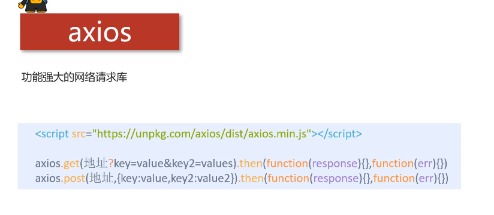

# 1.axios 功能强大的网络请求库



## 1.1 引入库

## 1.2 get/post请求

```html
<input type="button" value="get请求" class="get">
<input type="button" value="post请求" class="post">
<!-- 官网提供的 axios 在线地址 -->
<script src="https://unpkg.com/axios/dist/axios.min.js"></script>
<script>
    /*
        接口1：随机笑话
        请求地址：https://autumnfish.cn/api/joke/list
        请求方法：get
        请求参数：num(笑话条数，数字)
        响应内容：随机笑话
        */
    document.querySelector(".get").onclick = function () {
        axios.get("https://autumnfish.cn/api/joke/list?num=3")
        .then(function (response) {
            console.log(response);
        },function (err) {
            console.log(err);
        })
    }
    /*
        接口2：用户注册
        请求地址：https://autumnfish.cn/api/user/reg
        请求方法：post
        请求参数：username(用户名，字符串)
        响应内容：注册成功或失败
        */
    document.querySelector(".post").onclick = function () {
        axios.post("https://autumnfish.cn/api/user/reg",
            {username:"alice"})
        .then(function (response) {
            console.log(response);
        },function (err) {
            console.log(err);
        })
    }
</script>
```

# 2.总结

## 2.1 axios必须先导入才可以使用

## 2.2 使用get或post方法即可发送对应的请求

## 2.3 then方法中的回调函数会在请求成功或失败时触发

## 2.4 通过回调函数的形参可以获取响应内容，或错误信息


# 3.axios文档

https://github.com/axios/axios