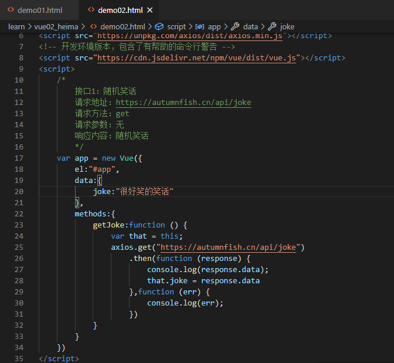

# 1.axios+vue


```html
<div id="app">
    <input type="button" value="获取笑话" @click="getJoke">
    <p>{{ joke }}</p>
</div>
<!-- 官网提供的 axios 在线地址 -->
<script src="https://unpkg.com/axios/dist/axios.min.js"></script>
<!-- 开发环境版本，包含了有帮助的命令行警告 -->
<script src="https://cdn.jsdelivr.net/npm/vue/dist/vue.js"></script>
<script>
    /*
        接口1：随机笑话
        请求地址：https://autumnfish.cn/api/joke
        请求方法：get
        请求参数：无
        响应内容：随机笑话
        */
    var app = new Vue({
        el:"#app",
        data:{
            joke:"很好笑的笑话"
        },
        methods:{
            getJoke:function () {
                var that = this;
                axios.get("https://autumnfish.cn/api/joke")
                    .then(function (response) {
                        console.log(response.data);
                        that.joke = response.data
                    },function (err) {
                        console.log(err);
                    })
            }
        }
    })
</script>
```



# 2.总结：

## 2.1 axios回调函数中的this已经改变，无法访问到data中数据

## 2.2 把this保存起来，回调函数中直接使用保存的this即可

## 2.3 和本地应用的最大区别就是改变了数据来源