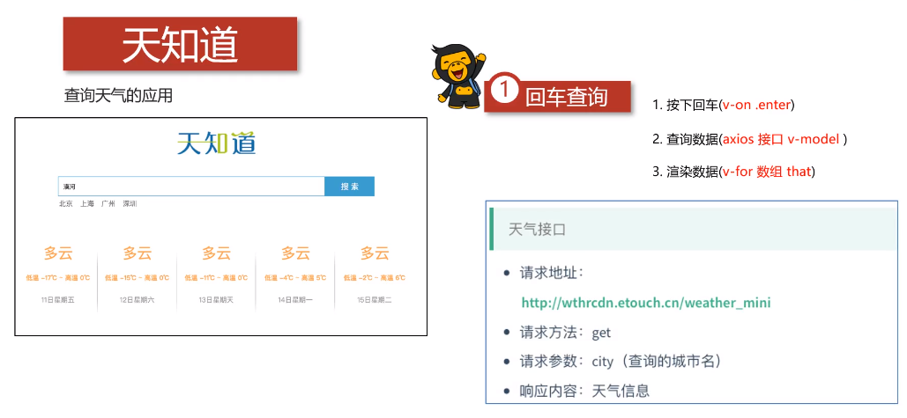
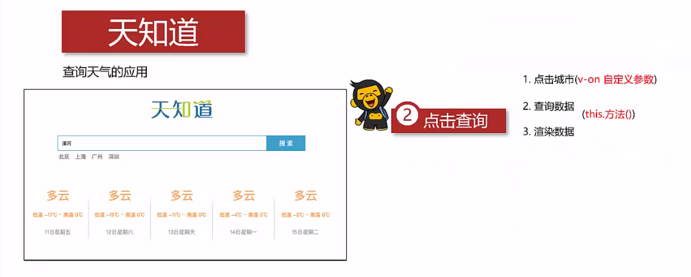

# 1.整体介绍

## 1.1 回车查询逻辑



## 1.2 点击查询逻辑



# 2.回车逻辑实现

## 2.1 html

```html
<div class="wrap" id="app">
	<div class="search_form">
	    <div class="logo">111</div>
	    <div class="form_group">
	        <input type="text" v-model="city" @keyup.enter="searchWeather"
	               class="input_text" placeholder="请输入查询的天气" />
	        <button class="input_sub">搜索</button>
	    </div>
	    <div class="hotkey">
	        <a href="javascript:;" @click="changeCity('北京')">北京</a>
	        <a href="javascript:;" @click="changeCity('上海')">上海</a>
	        <a href="javascript:;" @click="changeCity('广州')">广州</a>
	        <a href="javascript:;" @click="changeCity('深圳')">深圳</a>
	    </div>
	</div>
	<ul class="weather_list">
	    <li v-for="item in weatherList">
	        <div class="info_type"><span class="iconfont">{{ item.type }}</span></div>
	        <div class="info_temp">
	            <b>{{ item.low }}</b>
	            ~
	            <b>{{ item.high }}</b>
	        </div>
	        <div class="info_date">{{ item.date }}</div>
	    </li>
	</ul>
</div>
<!-- 官网提供的 axios 在线地址 -->
<script src="https://unpkg.com/axios/dist/axios.min.js"></script>
<!-- 开发环境版本，包含了有帮助的命令行警告 -->
<script src="https://cdn.jsdelivr.net/npm/vue/dist/vue.js"></script>
<!-- 自己的js -->
<script src="./js/main.js"></script>
```

## 2.2 main.js

```javascript
/*
    请求地址：http://wthrcdn.etouch.cn/weather_mini
    请求方法：get
    请求参数：city(城市名)
    响应内容：天气信息
*/
var app = new Vue({
    el:"#app",
    data:{
        city:'',
        weatherList:[],
    },
    methods:{
        searchWeather:function () {
            // 调用接口
            //保存this
            var that = this;
            axios.get('http://wthrcdn.etouch.cn/weather_mini?city='+this.city)
                .then(function (response) {
                    // console.log(response);
                    // console.log(response.data.data.forecast);
                    that.weatherList = response.data.data.forecast;
                })
                .catch(function (err) {

                })
        },
        changeCity:function (city) {
            this.city = city;
            this.searchWeather();
        }
    }
})
```

## 2.3 总结

### （1）应用的逻辑代码建议和页面分离，使用单独的js文件编写

### （2）axios回调函数中this指向改变了，需要额外的保存一份

### （3）服务器返回的数据比较复杂时，获取的时候需要注意层级结构

### （4）自定义参数可以让代码的复用性更高

### （5）methods中定义的方法内部，可以通过this关键字点出其他的方法 


# 3.回车逻辑实现

## 3.1 html

同上

## 3.2 main.js

同上

## 3.3 总结

（1）自定义参数，可以让代码的复用性更高

（2）methods中定义的方法内部，可以通过this关键字点出其他的方法