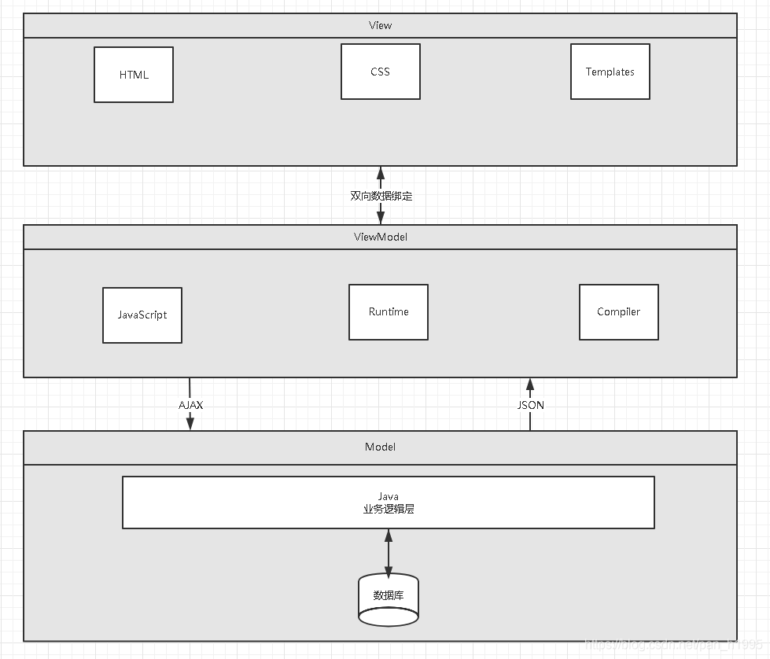
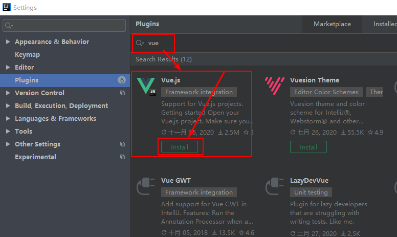

# 第一个Vue程序

参考：[链接](https://blog.csdn.net/pan_h1995/article/details/106766235)

# 1、什么是MVVM

  MVVM（Model-View-ViewModel）是一种软件设计模式，由微软WPF（用于替代WinForm，以前就是用这个技术开发桌面应用程序的）和Silverlight（类似于Java Applet，简单点说就是在浏览器上运行WPF）的架构师Ken Cooper和Ted Peters开发，是一种简化用户界面的**事件驱动编程方式**。由John Gossman（同样也是WPF和Sliverlight的架构师）与2005年在他的博客上发表。

  MVVM源自于经典的MVC（Model-View-Controller）模式。MVVM的核心是ViewModel层，负责转换Model中的数据对象来让数据变得更容易管理和使用。其作用如下：

- 该层向上与视图层进行双向数据绑定
- 向下与Model层通过接口请求进行数据交互


  MVVM已经相当成熟了，主要运用但不仅仅在网络应用程序开发中。当下流行的MVVM框架有`Vue.js`，`Anfular JS`

# 2、为什么要使用MVVM

  MVVM模式和MVC模式一样，主要目的是分离视图（View）和模型（Model），有几大好处

- **低耦合**：视图（View）可以独立于Model变化和修改，一个ViewModel可以绑定到不同的View上，当View变化的时候Model可以不变，当Model变化的时候View也可以不变。
- **可复用**：你可以把一些视图逻辑放在一个ViewModel里面，让很多View重用这段视图逻辑。
- **独立开发**：开发人员可以专注于业务逻辑和数据的开发（ViewMode），设计人员可以专注于页面设计。
- **可测试**：界面素来是比较难以测试的，而现在测试可以针对ViewModel来写。



## （1）View

  View是视图层， 也就是用户界面。前端主要由HTML和CSS来构建， 为了更方便地展现vi ew Model或者Model层的数据， 已经产生了各种各样的前后端模板语言， 比如FreeMarker，Thymeleaf等等， 各大MVVM框架如Vue.js.Angular JS， EJS等也都有自己用来构建用户界面的内置模板语言。

## （2）Model

  Model是指数据模型， 泛指后端进行的各种业务逻辑处理和数据操控， 主要围绕数据库系统展开。这里的难点主要在于需要和前端约定统一的接口规则

## （3）ViewModel

  ViewModel是由前端开发人员组织生成和维护的视图数据层。在这一层， 前端开发者对从后端获取的Model数据进行转换处理， 做二次封装， 以生成符合View层使用预期的视图数据模型。
  需要注意的是View Model所封装出来的数据模型包括视图的状态和行为两部分， 而Model层的数据模型是只包含状态的

- 比如页面的这一块展示什么，那一块展示什么这些都属于视图状态(展示)
- 页面加载进来时发生什么，点击这一块发生什么，这一块滚动时发生什么这些都属于视图行为(交互)

  视图状态和行为都封装在了View Model里。这样的封装使得View Model可以完整地去描述View层。由于实现了双向绑定， View Model的内容会实时展现在View层， 这是激动人心的， 因为前端开发者再也不必低效又麻烦地通过操纵DOM去更新视图。
  MVVM框架已经把最脏最累的一块做好了， 我们开发者只需要处理和维护View Model， 更新数据视图就会自动得到相应更新，真正实现`事件驱动编程`。
  View层展现的不是`Model`层的数据， 而是`ViewModel`的数据， 由`ViewModel`负责与`Model`层交互， 这就**完全解耦了View层和Model层， 这个解耦是至关重要的， 它是前后端分离方案实施的重要一环。**

# 2、Vue

Vue(读音/vju/， 类似于view) 是一套用于构建用户界面的渐进式框架， 发布于2014年2月。与其它大型框架不同的是， Vue被设计为可以自底向上逐层应用。Vue的核心库只关注视图层， 不仅易于上手， 还便于与第三方库(如：vue-router，vue-resource，vue x) 或既有项目整合。

## （1）MVVM模式的实现者

- Model：模型层， 在这里表示JavaScript对象
- View：视图层， 在这里表示DOM(HTML操作的元素)
- ViewModel：连接视图和数据的中间件， Vue.js就是MVVM中的View Model层的实现者

  在MVVM架构中， 是不允许数据和视图直接通信的， 只能通过ViewModel来通信， 而View Model就是定义了一个Observer观察者

- ViewModel能够观察到数据的变化， 并对视图对应的内容进行更新
- ViewModel能够监听到视图的变化， 并能够通知数据发生改变

  至此， 我们就明白了， Vue.js就是一个MV VM的实现者， 他的核心就是实现了DOM监听与数据绑定

## （2）为什么要使用Vue.js

- 轻量级， 体积小是一个重要指标。Vue.js压缩后有只有20多kb(Angular压缩后56kb+，React压缩后44kb+)
- 移动优先。更适合移动端， 比如移动端的Touch事件
- 易上手，学习曲线平稳，文档齐全
- 吸取了Angular(模块化) 和React(虚拟DOＭ) 的长处， 并拥有自己独特的功能，如：计算属性
- 开源，社区活跃度高
- ……


# 3、第一个Vue程序

## （0）IDEA安装VUE插件

  【说明】IDEA可以安装Vue的插件！如下图：
  注意：Vue不支持IE 8及以下版本， 因为Vue使用了IE 8无法模拟的ECMAScript 5特性。但它支持所有兼容ECMAScript 5的浏览器。



## （1）下载地址

- 开发版本

  - 包含完整的警告和调试模式：https：//yuejs.org/js/vue.js
  - 删除了警告， 30.96KBmin+gzip：https：//vuejs.org/js/vue.min.js

- CDN

  - ```
    <script src="https://cdn.jsdelivr.net/npm/vue@2.5.21/dist/vue.js"></script>
    ```

    ```
    <script src="https://cdn.jsdelivr.net/npm/vue@2.5.21/dist/vue.min.js"></script>
    ```

## （2）代码编写

  Vue.js的核心是实现了MVVM模式， 她扮演的角色就是View Model层， 那么所谓的第一个应用程序就是展示她的数据绑定功能，操作流程如下：
  **1、创建一个HTML文件**

```html
<!DOCTYPE html>
<html lang="en">
<head>
    <meta charset="UTF-8">
    <title>Title</title>
</head>
<body>

</body>
</html>
```

  **2、引入Vue.js**

```html
<!--1.导入Vue.js-->
<script src="https://cdn.jsdelivr.net/npm/vue@2.5.21/dist/vue.min.js"></script>
```

  **3、创建一个Vue实例**

```html
<script type="text/javascript">
    var vm = new Vue({
        el:"#app",
        /*Model：数据*/
        data:{
            message:"hello,vue!"
        }
    });
</script>
```

  说明：

- `el: '#vue'`：绑定元素的ID
- `data:{message:'Hello Vue!'}`：数据对象中有一个名为message的属性，并设置了初始值 Hello Vue！

  4、将数据绑定到页面元素

```html
<!--view层，模板-->
<div id="app">
    {{message}}
</div>
```

  说明：只需要在绑定的元素中使用双花括号将Vue创建的名为message属性包裹起来， 即可实现数据绑定功能， 也就实现了View Model层所需的效果， 是不是和EL表达式非常像?

## （3）完整的HTML

```html
<!DOCTYPE html>
<html lang="en">
<head>
    <meta charset="UTF-8">
    <title>Title</title>

</head>
<body>

<!--view层，模板-->
<div id="app">
    {{message}}
</div>

<!--1.导入Vue.js-->
<script src="https://cdn.jsdelivr.net/npm/vue@2.5.21/dist/vue.min.js"></script>
<script type="text/javascript">
    var vm = new Vue({
        el:"#app",
        /*Model：数据*/
        data:{
            message:"hello,vue!"
        }
    });
</script>
</body>
</html>
```

## （4）测试

  为了能够更直观的体验Vue带来的数据绑定功能， 我们需要在浏览器测试一番， 操作流程如下：
  1、在浏览器上运行第一个Vue应用程序， 进入开发者工具
  2、在控制台输入vm.message=‘HelloWorld’， 然后回车， 你会发现浏览器中显示的内容会直接变成HelloWorld


  此时就可以在控制台直接输入vm.message来修改值， 中间是可以省略data的， 在这个操作中， 我并没有主动操作DOM， 就让页面的内容发生了变化， 这就是借助了Vue的数据绑定功能实现的； MVVM模式中要求View Model层就是使用观察者模式来实现数据的监听与绑定， 以做到数据与视图的快速响应。

