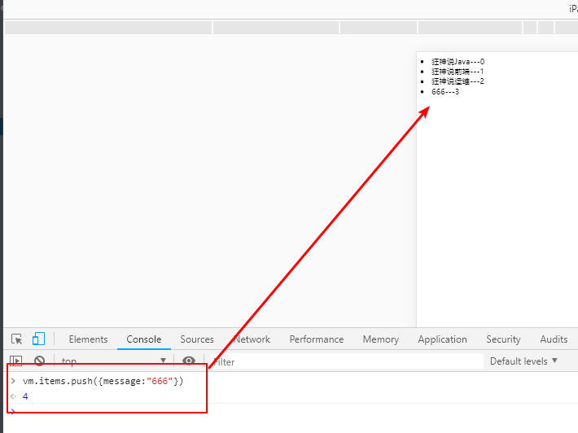

# 【狂神说Java】Vue学习笔记03-----基础语法指令

> https://www.bilibili.com/video/BV18E411a7mC)
>

[参考链接](https://blog.csdn.net/pan_h1995/article/details/106774536)


# 1、v-bind

  我们已经成功创建了第一个Vue应用!看起来这跟渲染一个字符串模板非常类似， 但是Vue在背后做了大量工作。现在数据和DOM已经被建立了关联， 所有东西都是响应式的。我们在控制台操作对象属性，界面可以实时更新!
  我们还可以使用v-bind来绑定元素特性!
  **上代码**

```html
<!DOCTYPE html>
<html lang="en" xmlns:v-bind="http://www.w3.org/1999/xhtml">
<head>
    <meta charset="UTF-8">
    <title>Title</title>

</head>
<body>

<!--view层，模板-->
<div id="app">
    <span v-bind:title="message">
    鼠标悬停几秒钟查看此处动态绑定的提示信息！
  </span>
</div>

<!--1.导入Vue.js-->
<script src="https://cdn.jsdelivr.net/npm/vue@2.5.21/dist/vue.min.js"></script>
<script type="text/javascript">
    var vm = new Vue({
        el:"#app",
        /*Model：数据*/
        data:{
            message: '页面加载于 ' + new Date().toLocaleString()
        }
    });
</script>
</body>
</html>
1234567891011121314151617181920212223242526272829
```

  你看到的v-bind等被称为指令。指令带有前缀v以表示它们是Vue提供的特殊特性。可能你已经猜到了， 它们会在渲染的DOM上应用特殊的响应式行为在这里，该指令的意思是：“将这个元素节点的title特性和Vue实例的message属性保持一致”。
  如果你再次打开浏览器的JavaScript控制台， 输入app， message=‘新消息’，就会再一次看到这个绑定了title特性的HTML已经进行了更新。

# 2、v-if， v-else

什么是条件判断语句，就不需要我说明了吧，以下两个属性!

- `v-if`
- `v-else`

  **上代码**

```html
<!DOCTYPE html>
<html lang="en" xmlns:v-bind="http://www.w3.org/1999/xhtml">
<head>
    <meta charset="UTF-8">
    <title>Title</title>
</head>
<body>
<!--view层，模板-->
<div id="app">
    <h1 v-if="ok">Yes</h1>
    <h1 v-else>No</h1>
   
</div>

<!--1.导入Vue.js-->
<script src="https://cdn.jsdelivr.net/npm/vue@2.5.21/dist/vue.min.js"></script>
<script type="text/javascript">
    var vm = new Vue({
        el:"#app",
        /*Model：数据*/
        data:{
            ok: true
        }
    });
</script>
</body>
</html>
```

  测试：
1.在浏览器上运行，打开控制台!
2.在控制台输入`vm.ok=false`然后回车，你会发现浏览器中显示的内容会直接变成NO
  注：使用`v-*`属性绑定数据是不需要`双花括号`包裹的

## v-else-if

- v-if
- v-else-if
- v-else
    注：`===`三个等号在JS中表示绝对等于(就是数据与类型都要相等)上代码：

```html
<!DOCTYPE html>
<html lang="en" xmlns:v-bind="http://www.w3.org/1999/xhtml">
<head>
    <meta charset="UTF-8">
    <title>Title</title>
</head>
<body>
<!--view层，模板-->
<div id="app">
    <h1 v-if="type==='A'">A</h1>
    <h1 v-else-if="type==='B'">B</h1>
    <h1 v-else-if="type==='D'">D</h1>
    <h1 v-else>C</h1>

</div>

<!--1.导入Vue.js-->
<script src="https://cdn.jsdelivr.net/npm/vue@2.5.21/dist/vue.min.js"></script>
<script type="text/javascript">
    var vm = new Vue({
        el:"#app",
        /*Model：数据*/
        data:{
            type: 'A'
        }
    });
</script>
</body>
</html>
1234567891011121314151617181920212223242526272829
```

# 3、v-for

- v-for

格式说明

```html
<div id="app">
    <li v-for="(item,index) in items">
        {{item.message}}---{{index}}
    </li>

</div>
123456
```

  注：`items`是数组，`item`是数组元素迭代的别名。我们之后学习的Thymeleaf模板引擎的语法和这个十分的相似！
  上代码：

```html
<!DOCTYPE html>
<html lang="en">
<head>
    <meta charset="UTF-8">
    <title>Title</title>
</head>
<body>
<!--view层，模板-->
<div id="app">
    <li v-for="(item,index) in items">
        {{item.message}}---{{index}}
    </li>

</div>

<!--1.导入Vue.js-->
<script src="https://cdn.jsdelivr.net/npm/vue@2.5.21/dist/vue.min.js"></script>
<script type="text/javascript">
    var vm = new Vue({
        el:"#app",
        /*Model：数据*/
        data:{
            items:[
                {message:'狂神说Java'},
                {message:'狂神说前端'},
                {message:'狂神说运维'}
            ]
        }
    });
</script>
</body>
</html>

```

  测试：在控制台输入`vm.items.push({message：'狂神说运维'})`，尝试追加一条数据，你会发现浏览器中显示的内容会增加一条`狂神说运维`.



