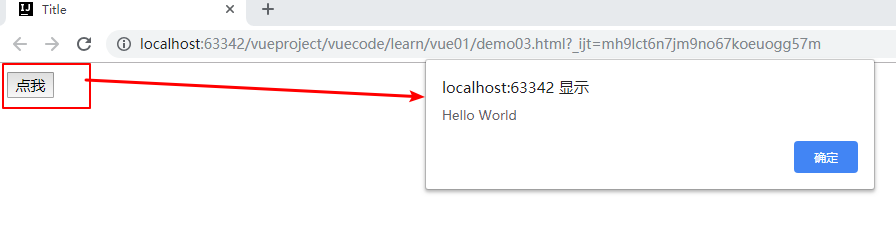

# 1.v-on:监听事件

​	事件有Vue的事件、和前端页面本身的一些事件!我们这里的`click`是vue的事件， 可以绑定到Vue中的`methods`中的方法事件!
  **上代码**：

```html
<!DOCTYPE html>
<html lang="en" xmlns:v-on="http://www.w3.org/1999/xhtml">
<head>
    <meta charset="UTF-8">
    <title>Title</title>
</head>
<body>

<div id="app">
    <button v-on:click="sayHi">点我</button>
</div>


<!--1.导入Vue.js-->
<script src="https://cdn.jsdelivr.net/npm/vue@2.5.21/dist/vue.min.js"></script>

<script type="text/javascript">
    var vm = new Vue({
        el:"#app",
        data:{
            message:'Hello World'
        },
        methods:{
            sayHi:function(event){
                //'this'在方法里面指向当前Vue实例
                alert(this.message);
            }
        }
    });
</script>
</body>
</html>
```

  **点击测试**
  Vue还有一些基本的使用方式， 大家有需要的可以再跟着官方文档看看， 因为这些基本的指令几乎我们都见过了，一通百通!掌握学习的方式!



## 1.1 v-on:简写

@替代v-on:

```sh
<div id="app">
    <button @click="sayHi">点我</button>
</div>
```


# 2.事件分类和查询

## 2.1 网址

https://www.jquery123.com/category/events/keyboard-events/

## 2.2 鼠标点击事件实例

https://www.jquery123.com/category/events/mouse-events/


