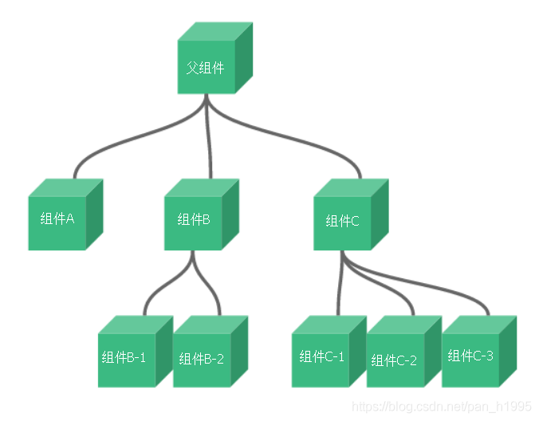

# 【狂神说Java】Vue学习笔记04----Vue：表单双绑、组件

[参考链接](https://blog.csdn.net/pan_h1995/article/details/106788652)

> 本文根据B站【狂神说Java】vue系列视频整理，如需观看视频，请点击链接跳转
> [【狂神说Java】Vue视频](https://www.bilibili.com/video/BV18E411a7mC)

# 1、什么是双向数据绑定

  Vue.js是一个MV VM框架， 即数据双向绑定， 即当数据发生变化的时候， 视图也就发生变化， 当视图发生变化的时候，数据也会跟着同步变化。这也算是Vue.js的精髓之处了。
  值得注意的是，我们所说的数据双向绑定，一定是对于UI控件来说的非UI控件不会涉及到数据双向绑定。单向数据绑定是使用状态管理工具的前提。如果我们使用vue x那么数据流也是单项的，这时就会和双向数据绑定有冲突。

## （1）为什么要实现数据的双向绑定

  在`Vue.js`中，如果使用`vuex`， 实际上数据还是单向的， 之所以说是数据双向绑定，这是用的UI控件来说， 对于我们处理表单， `Vue.js`的双向数据绑定用起来就特别舒服了。即两者并不互斥，在全局性数据流使用单项，方便跟踪；局部性数据流使用双向，简单易操作。

# 2、在表单中使用双向数据绑定

  你可以用`v-model`指令在表单、及元素上创建双向数据绑定。它会根据控件类型自动选取正确的方法来更新元素。尽管有些神奇， 但`v-model`本质上不过是语法糖。它负责监听用户的输入事件以更新数据，并对一些极端场景进行一些特殊处理。
  **注意：`v-model`会忽略所有表单元素的`value`、`checked`、`selected`特性的初始值而总是将`Vue`实例的数据作为数据来源。你应该通过`JavaScript`在组件的`data`选项中声明初始值!**

## （1）单行文本

```html
<!DOCTYPE html>
<html lang="en">
<head>
    <meta charset="UTF-8">
    <title>Title</title>
</head>
<body>
<div id="app">
    输入的文本：<input type="text" v-model="message" value="hello">{{message}}
</div>

<!--1.导入Vue.js-->
<script src="https://cdn.jsdelivr.net/npm/vue@2.5.21/dist/vue.min.js"></script>
<!--<script src="../js/vue.js"></script>-->
<script type="text/javascript">
    var vm = new Vue({
        el:"#app",
        data:{
            message:"可以666"
        }
    });
</script>
</body>
</html>
```

动态绑定


## （2）多行文本

```html
<!DOCTYPE html>
<html lang="en">
<head>
    <meta charset="UTF-8">
    <title>Title</title>
</head>
<body>
<div id="app">
   多行文本：<textarea v-model="pan"></textarea>&nbsp;&nbsp;多行文本是：{{pan}}
</div>

<script src="../js/vue.js"></script>
<script type="text/javascript">
    var vm = new Vue({
        el:"#app",
        data:{
            message:"Hello hello!"
        }
    });
</script>
</body>
</html>
```

## （3）单复选框

```html
<!DOCTYPE html>
<html lang="en">
<head>
    <meta charset="UTF-8">
    <title>Title</title>
</head>
<body>

<div id="app">

    性别：
    <input type="radio" name="sex" value="男"> 男
    <input type="radio" name="sex" value="女"> 女
    <br>
    单复选框：
    <input type="checkbox" id="checkbox" v-model="checked">
    &nbsp;&nbsp;
    <label for="checkbox">{{checked}}</label>
</div>

<!--1.导入Vue.js-->
<script src="https://cdn.jsdelivr.net/npm/vue@2.5.21/dist/vue.min.js"></script>
<script type="text/javascript">
    var vm = new Vue({
        el:"#app",
        data:{
            checked:false
        }
    });
</script>
</body>
</html>
```

## （4）多复选框

```html
<!DOCTYPE html>
<html lang="en">
<head>
    <meta charset="UTF-8">
    <title>Title</title>
</head>
<body>

<div id="app">
    多复选框：
    <input type="checkbox" id="jack" value="Jack" v-model="checkedNames">
    &nbsp;&nbsp;
    <label for="jack">Jack</label>
    <input type="checkbox" id="join" value="Join" v-model="checkedNames">
    &nbsp;&nbsp;
    <label for="join">Jack</label>
    <input type="checkbox" id="mike" value="Mike" v-model="checkedNames">
    &nbsp;&nbsp;
    <label for="mike">Mike</label>
    <span>选中的值：{{checkedNames}}</span>
</div>

<script src="../js/vue.js"></script>
<script type="text/javascript">
    var vm = new Vue({
        el:"#app",
        data:{
            checkedNames:[]
        }
    });
</script>
</body>
</html>
```

## （6）单选按钮

```html
<!DOCTYPE html>
<html lang="en">
<head>
    <meta charset="UTF-8">
    <title>Title</title>
</head>
<body>

<div id="app">
    单选框按钮
    <input type="radio" id="one" value="One" v-model="picked">
    <label for="one">One</label>
    <input type="radio" id="two" value="Two" v-model="picked">
    <label for="two">Two</label>
    <span>选中的值：{{picked}}</span>
</div>

<script src="../js/vue.js"></script>
<script type="text/javascript">
    var vm = new Vue({
        el:"#app",
        data:{
            picked:'Two'
        }
    });
</script>
</body>
</html>
```

## （7）下拉框

```html
<!DOCTYPE html>
<html lang="en">
<head>
    <meta charset="UTF-8">
    <title>Title</title>
</head>
<body>
<div id="app">
    <!--    性别：
        <input type="radio" name="sex" value="男" v-model="pan">男
        <input type="radio" name="sex" value="女" v-model="pan">女
        <p>选中了：{{pan}}</p>-->

    下拉框:
    <select v-model="pan">
        <option value="" disabled>---请选择---</option>
        <option>A</option>
        <option>B</option>
        <option>C</option>
        <option>D</option>
    </select>
    <span>value:{{pan}}</span>


</div>


<!--1.导入Vue.js-->
<script src="https://cdn.jsdelivr.net/npm/vue@2.5.21/dist/vue.min.js"></script>
<script type="text/javascript">
    var vm = new Vue({
        el:"#app",
        data:{
            pan:"A"
        }
    });
</script>
</body>
</html>
```

  注意：`v-model`表达式的初始值未能匹配任何选项，元系将被渲染为“未选中”状态。 在iOS中， 这会使用户无法选择第一个选项，因为这样的情况下，iOS不会触发`change`事件。因此，更推荐像上面这样提供一个值为空的禁用选项。


# 3、什么是组件

  组件是可复用的`Vue`实例， 说白了就是一组可以重复使用的模板， 跟`JSTL`的自定义标签、`Thymeleal`的`th:fragment`等框架有着异曲同工之妙，通常一个应用会以一棵嵌套的组件树的形式来组织：



  例如，你可能会有页头、侧边栏、内容区等组件，每个组件又包含了其它的像导航链接、博文之类的组件。

## （0）官网

https://cn.vuejs.org/v2/guide/components.html


## （1）第一个Vue组件

  注意：在实际开发中，我们并不会用以下方式开发组件，而是采用`vue-cli`创建，`vue`模板文件的方式开发，以下方法只是为了让大家理解什么是组件。
  **使用`Vue.component()`方法注册组件，格式如下：**

```html
<div id="app">
  <pan></pan>
</div>

<script src="../js/vue.js"></script>
<script type="text/javascript">
    //先注册组件
    Vue.component("pan",{
        
        template:'<li>Hello</li>'

    });
    //再实例化Vue
    var vm = new Vue({
        el:"#app",
    });
</script>
```

  说明：

- `Vue.component()`：注册组件
- `pan`：自定义组件的名字
- `template`：组件的模板

## （2）使用~~props~~属性传递参数

  **像上面那样用组件没有任何意义，所以我们是需要传递参数到组件的，此时就需要使用`props`属性了！**
  **注意：默认规则下props属性里的值不能为大写；**

```html
<!DOCTYPE html>
<html lang="en">
<head>
    <meta charset="UTF-8">
    <title>Title</title>
</head>
<body>

<div id="app">
    <!--组件：传递给组件中的值：props-->
  <pan v-for="item in items" v-bind:panh="item"></pan>
</div>

<script src="../js/vue.js"></script>
<script type="text/javascript">
    //定义组件
    Vue.component("pan",{
        props:['panh'],
        template:'<li>{{panh}}</li>'

    });
    var vm = new Vue({
        el:"#app",
        data:{
            items:["java","Linux","前端"]
        }
    });
</script>
</body>
</html>
```

  **说明**：

- `v-for="item in items"`：遍历`Vue`实例中定义的名为`items`的数组，并创建同等数量的组件
- `v-bind:panh="item"`：**将遍历的`item`项绑定到组件中`props`定义名为`item`属性上**；~~= 号左边的`panh`为`props`定义的属性名，右边的为`item in items` 中遍历的item项的值~~

## **【重新复习绑定！】**props:，是通过获取属性，可以获取属性对应的绑定值！从而，组件可以获得外部的值！

